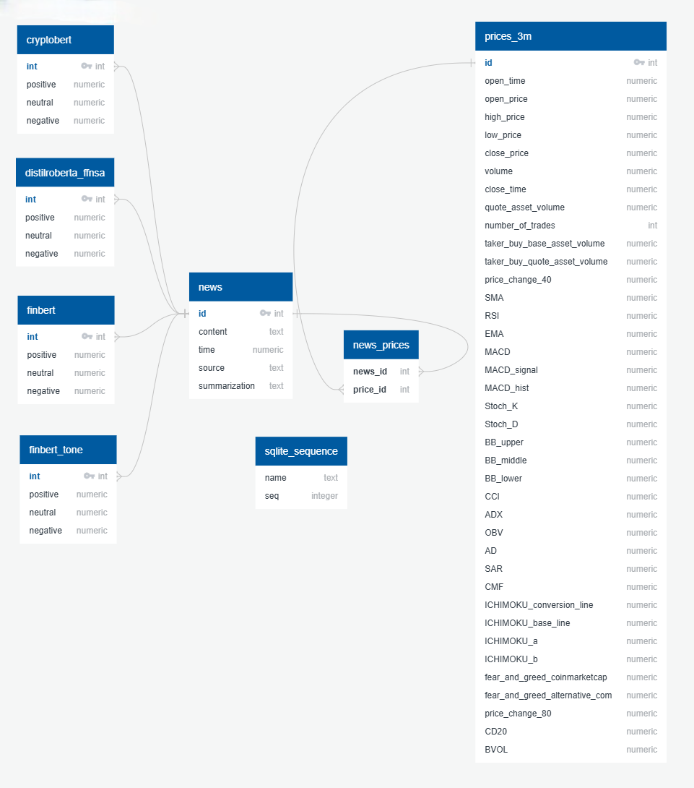

# Bitcoin Price and Crypto News Analysis

This project combines Bitcoin price data and news from various crypto websites to create a comprehensive database for analysis. The main goals are to summarize news articles, perform sentiment analysis, and explore correlations between Bitcoin prices and crypto news sentiments.

## Project Highlights

1. Data Collection:

- Downloaded Bitcoin price data from Binance.
- Built scrapers to collect news from multiple crypto websites.

2. Data Integration:

- Combined Bitcoin price data and news articles into a unified database.

3. News Summarization:

- Used the [distilbart-cnn-12-6](https://huggingface.co/sshleifer/distilbart-cnn-12-6) model for summarizing large volumes of news.
- Subabase and Azure Cloud for efficient summarization.

4. Sentiment Analysis:

- Analyzed summarized news using four models:
  - [cryptobert](https://huggingface.co/ElKulako/cryptobert)
  - [distilroberta-finetuned-financial-news-sentiment-analysis](https://huggingface.co/mrm8488/distilroberta-finetuned-financial-news-sentiment-analysis)
  - [finbert](https://huggingface.co/ProsusAI/finbert)
  - [finbert-tone](https://huggingface.co/yiyanghkust/finbert-tone)

5. Analysis:

- Evaluated model performance using dispersion metrics and correlation matrices.

6. Final Output:

- Merged news and Bitcoin price data by datetime, creating a final database for further analysis.

## Final database

## Repository Features

- Python scripts for data collection and processing.
- Notebooks with detailed analysis and visualizations.
- Examples of sentiment analysis and summarization workflows.

This repository is a resource for researchers and developers interested in financial data analysis, natural language processing, and cryptocurrency trends.
